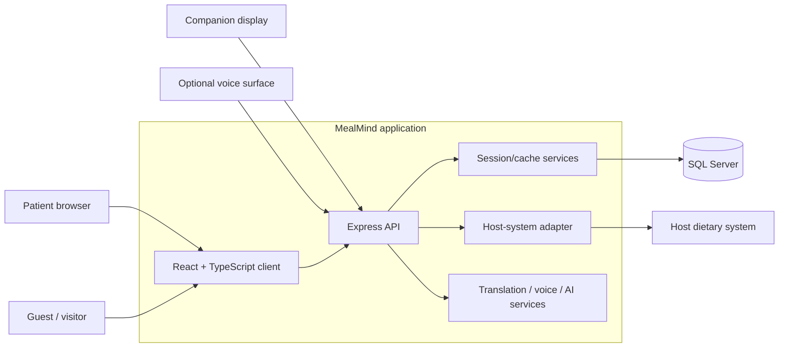
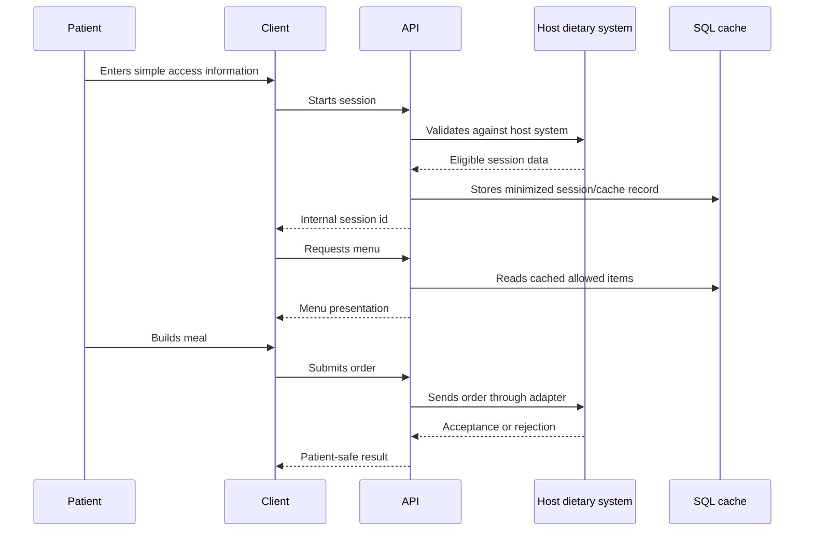

# Architecture

MealMind is a patient meal ordering surface layered over an existing hospital
dietary system. The host system remains the operational source of truth; MealMind
provides a modern, accessible ordering experience and a controlled cache/session
layer.

## High-Level Shape

## Responsibilities

| Layer | Responsibility |
| --- | --- |
| Client | Patient and guest UX, accessibility, language presentation |
| API | Auth flow, CSRF, session handling, order submission, route boundaries |
| Session/cache | Reduced host-system round trips, internal IDs, order state |
| Adapter | Private boundary to host dietary system |
| AI/voice | Optional translation, voice interaction, and assisted ordering |

## Core Principle

MealMind is not the source of truth for clinical or dietary authority. It is a
patient experience and workflow layer. The host system owns eligibility, menu
availability, and final order acceptance.

## Request Flow

## Integration Boundary

The production system includes private host-system integration details. This
proof repo only documents the boundary:

- host system validates meal eligibility
- host system remains the order authority
- MealMind stores minimized session/cache data
- browser receives an internal ID, not the host-system patient identifier
- failures are translated into patient-safe messages

## Why The Architecture Matters

Hospital meal ordering is not generic ecommerce:

- users may be ill, elderly, medicated, or unfamiliar with technology
- ordering must respect diet and allergy limits
- guest ordering must avoid exposing patient data
- bedside devices may be shared or locked down
- network and host-system failures must degrade safely

MealMind's architecture is built around those constraints.
