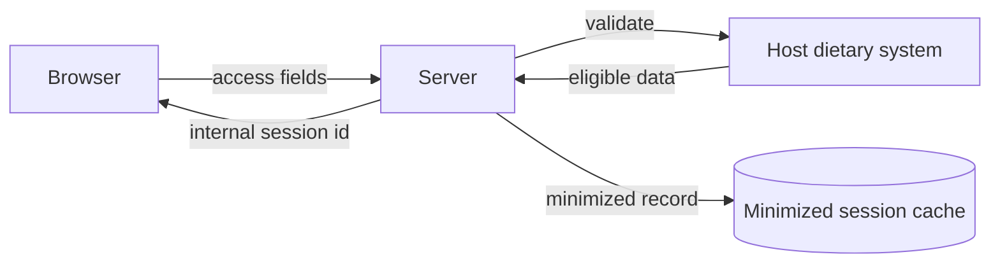

# Security and PHI

MealMind's most important architectural decision is minimizing the amount of
sensitive patient information the application owns or exposes.

## PHI Boundary

The browser should not receive host-system patient identifiers. The server
validates the patient session and returns an internal session identifier for the
UI workflow.

## Security Controls

Representative controls from the production design:

- sensitive values encrypted at rest
- httpOnly secure cookies
- CSRF protection on mutating routes
- session rotation on login
- patient-safe error messages
- audit logging for important actions
- fail-fast production startup when required secrets are missing
- no sensitive identifiers in AI prompts

## Minimum Viable PHI

The product should not own a value simply because an upstream system returns it.
If the ordering workflow can proceed with a less sensitive surrogate, use the
surrogate.

## Public Proof Boundary

This proof repo does not include:

- real patient data
- real menus
- host-system contracts
- environment variables
- deployment workflows
- production screenshots containing identifying information
- schema details sufficient to recreate the private system
