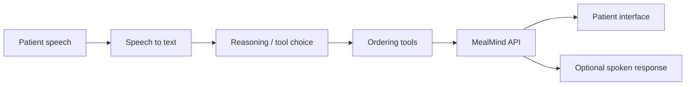

# Voice and AI

MealMind treats voice and AI as optional access layers. The core patient
ordering experience remains browse-and-tap.

## Voice Principles

- Voice is additive, not required.
- Tool execution goes through the backend API.
- Voice cannot bypass validation, session checks, or order rules.
- Prompts use minimized menu context rather than patient identifiers.
- If voice fails, the core ordering interface still works.

## Voice Flow

## Tool Surface

Representative voice tools:

- navigate to a meal period
- navigate to a category
- add a menu item
- remove a menu item
- clear the cart
- read back the cart
- check item allergens
- submit the order

The model decides intent. The backend performs the action.

## Translation

AI-assisted translation is useful for menu presentation and accessibility, but
translation output should be cached and reviewed where needed. The patient
experience should not depend on repeated live model calls for stable menu text.

## Risk Discipline

AI should not invent diet permissions, override host-system restrictions, expose
patient identifiers, or submit irreversible actions without the same backend
validation used by the touch interface.
